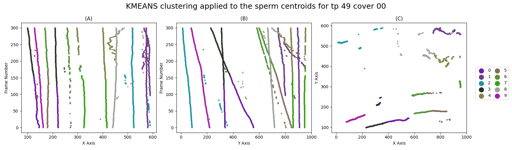
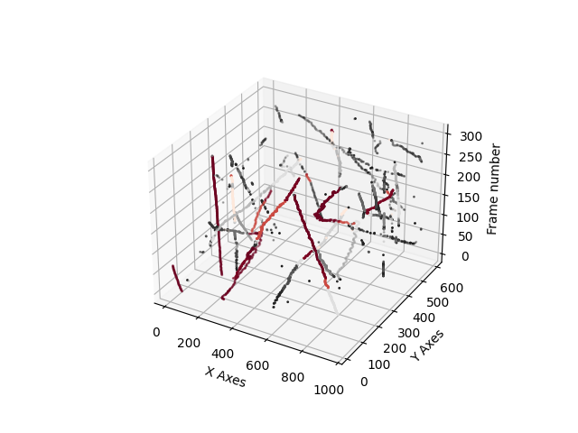

##### Table of Contents
-------------
<!--ts-->
    [Table of Contents](#####Table-of-Contents)
    [Latest Verison](#Latest-Version)
       * [Test files](##Test-files)
<!--te-->

#Latest version
The latest version for the tracking algorithm is ```tracking_algorithm39```.

##Test files
There are test files for verififying the functions work for all the data. There is a plot and no-plot to verify plotting works.

## Motility Calculations
The file:
```MotilityCalc.py``` produces the RMS distances travelled using 'Mike' based clustering. The algorithm doesn't have a mathematical name, but I would suggest calling it K-patch. 

# Using the package to cluster data
Clustering the Data: 

To run an clustering algorithm `ALGO` on test patient (tp) `tp` and cover `cover`, the function ```run_main(algorithm=ALGO, tp=tp, cover=cover, plot=True, plot_type='2d')``` will calculate the clusters using the specified algorithm, return the cluster ID predictions and plot a 2D graph of the results. 

## Parameters 

### Algorithm 
Must be a string. 
Currently accepted are: ```["kmeans", "dbscan", "mike", "none", "hdbscan", "gmm", "htdbscan", "richard-dbscan"]``` 

### TP 
2 digit string. 

For the provided data ```['49', '57']```

Default `'49'`
### Cover 
2 digit string. 

For the provided data ```['00', '01', '02', '03', '04', '05', '06', '07', '08', '09', '10', '11', '12', '13', '14', '15', '16', '17', '18', '19']```

Default `'57'`
### Plot 
Bool. 

Plot = True will plot the graph, Plot = False will not plot the graph 

Default `False`
### Verbose
Bool. 

Verbose = True will print all information to console. Verbose = False will only print some information if any. 

Default `False`
### Plot type 
String. 

Currently accepted are: ```['2d', '3d', 'bar_graph']```

### Heatmap 
Bool. 

heatmap = True will change the colour scheme to using a heatmap where colour represents the U value accuracy. 

heatmap = False will use default colour scheme where every cluster is a different randomised cluster from palette rgb(0.05 to 0.7, 0.05 to 0.7, 0.05 to 0.7) .

## Examples:
### 1
```python 
run_main(algorithm='kmeans', cover='00', plot=True, plot_type='2d')
```
 


### 2
```python 
run_main(algorithm='mike', cover='04', plot=true, plot_type='3d', heatmap=True
```


